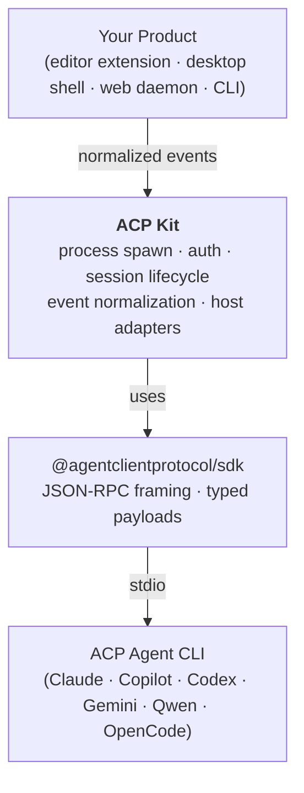

# ACP Kit

[](https://github.com/xingsy97/acp-kit/actions/workflows/ci.yml)
[](https://www.npmjs.com/package/@acp-kit/core)
[](https://www.npmjs.com/package/@acp-kit/core)
[](./LICENSE)
[](https://nodejs.org)
[](#status)

**ACP Kit is a runtime for building applications on top of the [Agent Client Protocol](https://agentclientprotocol.com/).**

It launches an ACP agent process, manages the protocol connection, handles authentication, exposes host adapters for permissions / files / terminals, and turns raw `session/update` traffic into normalized turn, message, reasoning, and tool events. Your application chooses an agent profile, attaches a host, opens a session, and consumes stable events.

**Why ACP Kit:**

- **Stable events over messy `session/update`.** Per-message, per-tool, per-turn events with correlation ids (`messageId`, `toolCallId`, `turnId`) &mdash; drive UI state and transcripts without parsing raw protocol traffic.
- **Lifecycle is handled for you.** Cross-platform process spawn, startup diagnostics, `auth_required` retry, `session.error` surfacing, vendor `_meta` pass-through, multiple sessions over one agent process.
- **Six common agents, one import.** `import { ClaudeCode, GitHubCopilot, CodexCli, GeminiCli, QwenCode, OpenCode } from '@acp-kit/core'` &mdash; or drive any other ACP-capable agent via a custom `AgentProfile`.

---

## Contents

- [Install](#install)
- [Quick Start](#quick-start)
- [Examples](#examples)
- [What ACP Kit Does](#what-acp-kit-does)
- [API Overview](#api-overview)
- [Supported ACP Agents](#supported-acp-agents)
- [How It Compares to `@agentclientprotocol/sdk`](#how-it-compares-to-agentclientprotocolsdk)
- [Compatibility](#compatibility)
- [Status](#status)
- [Documentation](#documentation)
- [Development](#development)
- [License](#license)

## Install

```bash
npm install @acp-kit/core
```

Requirements:

- Node.js **>= 20.11** (required for `await using` / `Symbol.asyncDispose` used in the examples below; if you cannot upgrade, call `acp.shutdown()` and `session.dispose()` explicitly and Node 18 still works)
- A reachable ACP agent CLI (for example Copilot CLI, Claude ACP, Codex ACP) installed on the machine running the runtime

## Quick Start

Open a session and subscribe to **normalized** events. Each event has a stable `type`,
stable correlation ids (`messageId`, `toolCallId`, `turnId`), and a typed payload &mdash;
the runtime aggregates raw `session/update` traffic for you.

```ts
import { createAcpRuntime, ClaudeCode } from '@acp-kit/core';

await using acp = createAcpRuntime({
  agent: ClaudeCode,
  host: {
    requestPermission: async () => 'allow_once',
    chooseAuthMethod:  async ({ methods }) => methods[0]?.id ?? null,
  },
});

await using session = await acp.newSession({ cwd: process.cwd() });

session.on({
  messageDelta:  (e) => process.stdout.write(e.delta),
  toolStart:     (e) => console.log(`\n[tool ${e.toolCallId}] ${e.title ?? e.name}`),
  toolEnd:       (e) => console.log(`[tool ${e.toolCallId}] ${e.status}`),
  turnCompleted: (e) => console.log(`\n(turn ${e.turnId} done: ${e.stopReason})`),
});

await session.prompt('Summarize this repository.');
```

The handler keys are camelCase; each callback receives the matching event variant
with full type narrowing &mdash; no string literals to remember.
For the full list see [`RuntimeEventKind`](packages/core/src/runtime-event.ts).

If you only need to watch a single event type, use a typed listener directly:

```ts
session.on('tool.start', (e) => console.log(e.toolCallId, e.title)); // e: ToolStartEvent
session.on('message.delta', (e) => process.stdout.write(e.delta));   // e: MessageDeltaEvent
```

`session.on(...)` is overloaded: pass a handler map for camelCase dispatch, a
literal event type to narrow a single listener, or `'event'` to receive every
`RuntimeSessionEvent`.

One runtime owns one agent subprocess and can host many sessions over different
`cwd`s &mdash; see [`examples/pair-programming/`](examples/pair-programming/).

## Examples

The repository ships with five runnable examples under [`examples/`](examples/). Each one is a standalone npm package that installs the published `@acp-kit/core` from npm:

| Example | Runs without an agent installed | What it shows |
| --- | :---: | --- |
| [`quick-start/`](examples/quick-start/) | No | Minimal single-prompt script. |
| [`pair-programming/`](examples/pair-programming/) | No | Two sessions in one runtime as AUTHOR + REVIEWER, looping until the reviewer says `APPROVED`. |
| [`mock-runtime/`](examples/mock-runtime/) | **Yes** | Self-contained mock ACP server. Use this to see the full event flow without installing an agent. |
| [`real-agent-cli/`](examples/real-agent-cli/) | No | Interactive CLI driver for real agents (`copilot`, `claude`, `codex`, `gemini`, `qwen`, `opencode`) with prompts for auth and permission decisions. |
| [`web-daemon/`](examples/web-daemon/) | No | Tiny `node:http` + Server-Sent Events demo: POST a prompt, stream normalized events back to a browser. |

```bash
cd examples/mock-runtime
npm install
npm start
```

See [`examples/README.md`](examples/README.md) for details.

## What ACP Kit Does



A real ACP client has to do all of this before it can hold a useful conversation:

- choose which agent implementation to talk to and where it lives on disk
- spawn that agent in a platform-safe way (Windows quirks, login shells, env propagation)
- detect startup failure and surface stderr / exit reasons clearly
- bootstrap an ACP connection with `initialize`
- handle `auth_required` during `session/new`, run an auth method, retry
- create sessions
- expose host adapters (permission prompts, file access, terminal access)
- turn raw `session/update` traffic into stable message / reasoning / tool / usage events
- decide when a turn is actually complete

ACP Kit packages all of the above behind `createAcpRuntime({...}).newSession({ cwd })` (or the `runOneShotPrompt` one-shot helper).

## API Overview

`RuntimeSession` emits **normalized `RuntimeSessionEvent`s** &mdash; stable per-message,
per-tool, and per-turn events with correlation ids (`messageId`, `toolCallId`,
`turnId`). They drive transcripts, UI state, and multi-agent orchestration.

If you need raw protocol traffic (debuggers, protocol bridges), use
`composeWireMiddleware` / `normalizeWireMiddleware` to observe the exact JSON-RPC
frames before / after normalization.

```ts
import {
  createAcpRuntime,
  ClaudeCode,
  type RuntimeHost,
  type RuntimeSessionEvent,
  type AgentProfile,
} from '@acp-kit/core';

await using acp = createAcpRuntime({
  agent: ClaudeCode,           // built-in constant, or a custom AgentProfile literal
  host: {
    requestPermission: async (req) => 'allow_once',
    chooseAuthMethod:  async ({ methods }) => methods[0]?.id ?? null,
    // Optional: file system + terminal capabilities are advertised to the
    // agent only when the corresponding host methods are provided.
    // readTextFile / writeTextFile take ACP request/response objects from
    // @agentclientprotocol/sdk; createTerminal must be paired with
    // terminalOutput / waitForTerminalExit / killTerminal / releaseTerminal.
  } satisfies RuntimeHost,
});

await using session = await acp.newSession({ cwd: '/path/to/workspace' });

// Subscribe with a handler map (camelCase keys, full type narrowing per handler)
session.on({
  messageDelta:  (e) => process.stdout.write(e.delta),
  toolStart:     (e) => console.log(`[tool ${e.toolCallId}] ${e.title ?? e.name}`),
  toolEnd:       (e) => console.log(`[tool ${e.toolCallId}] ${e.status}`),
  turnCompleted: (e) => console.log(`done: ${e.stopReason}`),
});

const result = await session.prompt('Refactor utils.ts'); // Promise<PromptResult>
await session.cancel();        // optional: cancel the in-flight turn
// session and runtime are disposed automatically by `await using`
```

Lifecycle helpers:

- `acp.shutdown()` &mdash; explicit teardown if you cannot use `await using`.
- `acp.reconnect()` &mdash; drop the current agent process and reconnect without
  losing application-level state.
- `session.setMode(modeId)` / `session.setModel(modelId)` &mdash; switch agent mode
  or model mid-session when the agent advertises options.

One-shot helper (spawn agent + run one prompt + auto-dispose):

- `runOneShotPrompt({ agent, cwd, prompt })` &mdash; yields `RuntimeSessionEvent`s.

The full surface is exported from a single entry point: `@acp-kit/core`.

## Supported ACP Agents

ACP Kit can drive any agent that speaks the Agent Client Protocol over stdio. Six agents ship as named constants you import and pass as `agent: <Constant>`; any other ACP-capable agent works via a custom `AgentProfile` literal (see below).

| Agent | Constant | `session/load` | `setMode` | `setModel` |
| --- | --- | :---: | :---: | :---: |
| Claude Code | `ClaudeCode` | ? | ? | ? |
| GitHub Copilot | `GitHubCopilot` | ? | ? | ? |
| Codex CLI | `CodexCli` | ? | ? | ? |
| Gemini CLI | `GeminiCli` | ? | ? | ? |
| Qwen Code | `QwenCode` | ? | ? | ? |
| OpenCode | `OpenCode` | ? | ? | ? |

> The runtime supports `session/load`, `setMode`, and `setModel` for every agent that advertises the corresponding capability in `initialize`. `?` = the maintainers have not yet recorded a verified test against a specific agent CLI version. `session/cancel` is required by the ACP spec and works for all agents above. PRs filling in the matrix (with the agent CLI version tested) are welcome &mdash; see [`.github/ISSUE_TEMPLATE/agent_compatibility.md`](.github/ISSUE_TEMPLATE/agent_compatibility.md).

All constants are exported from `@acp-kit/core`. Need to override one field (e.g. inject an env var)? Spread it:

```ts
import { createAcpRuntime, ClaudeCode } from '@acp-kit/core';

await using acp = createAcpRuntime({
  agent: { ...ClaudeCode, env: { ANTHROPIC_API_KEY: process.env.ANTHROPIC_API_KEY! } },
  host,
});
```

For a brand-new agent, write an `AgentProfile` literal:

```ts
const myAgent: AgentProfile = {
  id: 'my-agent',
  displayName: 'My Agent',
  command: 'my-agent-cli',
  args: ['--acp'],
  env: { /* optional */ },
};

await using acp = createAcpRuntime({ agent: myAgent, host });
```

## How It Compares to `@agentclientprotocol/sdk`

ACP Kit is built **on top of** [`@agentclientprotocol/sdk`](https://www.npmjs.com/package/@agentclientprotocol/sdk), not as a replacement.

- `@agentclientprotocol/sdk` is the **protocol toolkit**. It gives you `ClientSideConnection`, `ndJsonStream`, typed request/response/notification payloads, and JSON-RPC framing — once you already have a connection to an ACP server.
- ACP Kit is the **client runtime**. It launches the agent, manages the connection lifecycle, runs auth, exposes host adapters, normalizes raw protocol updates into stable events, and tracks turn state.

The protocol layer underneath stays exactly `@agentclientprotocol/sdk`. ACP Kit does not fork it, replace it, or hide it — it depends on it as a regular npm dependency.

```text
┌──────────────────────────────────────────────────────────────────┐
│  Your Product (editor extension, desktop shell, daemon, web …)   │
│  - product UI / state                                            │
│  - product persistence and remote sync                           │
│  - cross-session orchestration                                   │
└───────────────────────────────▲──────────────────────────────────┘
                                │  normalized events:
                                │  message.delta / reasoning.delta
                                │  tool.start / tool.update / tool.end
                                │  turn.started / turn.completed / turn.failed
                                │
┌───────────────────────────────┴──────────────────────────────────┐
│                          ACP Kit                                 │
│  agent profiles · process spawn · startup diagnostics            │
│  auth orchestration · session creation                           │
│  host adapters: permission, fs, terminal                         │
│  session/update normalization · transcript reduction             │
│  turn lifecycle (start / complete / cancel / fail)               │
└───────────────────────────────▲──────────────────────────────────┘
                                │  uses
                                │
┌───────────────────────────────┴──────────────────────────────────┐
│                    @agentclientprotocol/sdk                      │
│  ClientSideConnection · ndJsonStream · JSON-RPC framing          │
│  initialize · session/new · session/prompt · session/update      │
└───────────────────────────────▲──────────────────────────────────┘
                                │  bytes over a transport
                                │  (this repo: child-process stdio)
                                │
┌───────────────────────────────┴──────────────────────────────────┐
│   ACP Server (Copilot CLI --acp, Claude ACP, Codex ACP, …)       │
└──────────────────────────────────────────────────────────────────┘
```

For a deeper walkthrough see [`docs/acp-sdk-vs-runtime.md`](docs/acp-sdk-vs-runtime.md).

## Compatibility

| Dependency | Version |
| --- | --- |
| `@agentclientprotocol/sdk` | `^0.18` |
| Node.js | `>= 20.11` recommended (for `await using`); `>= 18` works if you dispose manually |
| TypeScript (consumers) | `>= 5.2` (for `using` / `await using` syntax) |
| OS | Windows, macOS, Linux |

ACP Kit aims to track the latest stable `@agentclientprotocol/sdk` minor release. Breaking changes in the SDK will be matched by a minor or major bump in `@acp-kit/core` while v0.x is in effect.

## Status

ACP Kit is **experimental (v0.x)**. The public API may change between minor versions until v1.0.

Implemented today:

- Built-in agent profiles for Copilot, Claude, Codex, Gemini, Qwen, and OpenCode; any other ACP-capable agent works via a custom profile
- Cross-platform process spawn with startup timeout, stderr capture, and exit diagnostics
- ACP connection bootstrap on top of `@agentclientprotocol/sdk`
- Auth retry when `session/new` returns `auth_required`
- Host adapters for permission, file system, and terminal (advertised by capability)
- Normalized `RuntimeSessionEvent` surface (`message.*`, `reasoning.*`, `tool.*`,
  `turn.*`, `status.changed`, `session.*.updated`) with handler-map dispatch via
  `session.on({ messageDelta, toolStart, ... })`
- Multiple sessions per runtime over different `cwd`s, each with `Symbol.asyncDispose` (`await using`)
- Idempotent `acp.shutdown()` and `acp.reconnect()`; `runOneShotPrompt` one-shot helper
- Transcript reducer with pending-stream completion flushing

Not implemented yet:

- `session/load` resume flows
- Higher-level collaboration semantics (delegation, sub-agents)

See [`docs/migration-plan.md`](docs/migration-plan.md) for how downstream products can adopt the runtime incrementally.

## Documentation

- [`docs/acp-sdk-vs-runtime.md`](docs/acp-sdk-vs-runtime.md) — the boundary between the official SDK and ACP Kit
- [`docs/architecture.md`](docs/architecture.md) — runtime layers and design principles
- [`docs/package-plan.md`](docs/package-plan.md) — why ACP Kit ships as a single package today and when to split
- [`docs/migration-plan.md`](docs/migration-plan.md) — incremental adoption path for existing ACP products

## Development

```bash
npm install        # install workspace deps (packages/core only)
npm run build      # tsc -b packages/core
npm test           # vitest run
```

To try an example:

```bash
cd examples/mock-runtime
npm install
npm start
```

Repository layout:

```text
packages/core/     @acp-kit/core source, tests, build output
docs/              architecture and design notes
examples/          standalone npm packages that depend on the published @acp-kit/core
```

Contributions are welcome. Please open an issue to discuss non-trivial changes before sending a PR.

## License

[MIT](./LICENSE)
