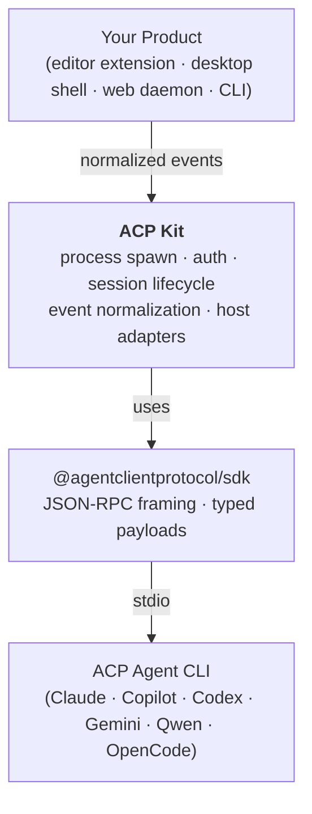

# ACP Kit Architecture

This document describes the proposed architecture for ACP Kit.

## Goal

Create a reusable runtime layer above `@agentclientprotocol/sdk` that multiple ACP-based applications can share without forcing them into the same UI, storage, or remote-control model.

## Architecture in One Diagram



Text fallback (for renderers without mermaid support):

```text
Applications and Product Shells
  - VS Code extension
  - Tauri desktop app
  - Web daemon + remote portal
  - CLI or mobile companion

        use
         |
         v
ACP Kit
  - agent profiles
  - connection lifecycle
  - auth orchestration
  - host capability adapters
  - update normalization
  - turn and transcript state

        uses
         |
         v
@agentclientprotocol/sdk
  - ACP schemas
  - JSON-RPC stream connection
  - typed ACP method calls
```

## Layer Definitions

## 1. Protocol Layer

This is the official ACP SDK.

Responsibilities:

- transport framing
- typed requests and notifications
- ACP connection objects
- ACP schema evolution

ACP Kit should depend on this layer instead of reimplementing it.

## 2. Runtime Layer

This is the new shared layer proposed for this repository.

Responsibilities:

- agent launch configuration
- platform-specific spawn behavior
- auth and session bootstrap orchestration
- timeout and retry policy
- raw traffic observation hooks
- normalization of ACP updates into canonical runtime events
- turn lifecycle management
- transcript reduction for higher-level consumers

This is the extraction target.

## 3. Product Layer

This is application-specific logic.

Examples:

- VS Code webviews and editor integration
- Tauri app state and local persistence
- Web PubSub relay rooms and daemon orchestration
- mobile device session sync
- product-specific permissions UI

This layer should consume ACP Kit, not be absorbed into it.

## Core Design Principles

### 1. Normalize once

The same raw ACP updates should not be reinterpreted differently in every client.

ACP Kit should define one canonical event model so all consumers receive the same meaning for:

- assistant text
- reasoning text
- tool lifecycle
- mode changes
- model changes
- command updates
- usage updates
- prompt completion

### 2. Keep host-specific capabilities behind adapters

ACP agents may request:

- file system access
- terminal access
- permission decisions

ACP Kit should define stable host interfaces for those capabilities. Each application can implement those interfaces using its own platform APIs.

### 3. Separate raw ACP from normalized runtime events

Consumers often need both:

- raw ACP traffic for debugging
- normalized runtime events for application logic

ACP Kit should expose both, instead of forcing one or hiding the other.

### 4. Treat turn lifecycle as first-class state

Most product bugs happen at the boundary between streaming updates and final completion.

ACP Kit should make turn lifecycle explicit, not implicit.

That includes:

- turn start
- streaming state
- terminal state
- cancellation
- failure

### 5. Keep collaboration out of the first core

Subagents, delegation, session linking, relay rooms, and fan-out workflows are higher-level concerns.

They should build on top of the runtime event model, not shape the runtime core itself.

## Canonical Runtime Event Model

The runtime should expose a small, product-friendly event vocabulary.

Example event families:

- `message.delta`
- `message.completed`
- `reasoning.delta`
- `reasoning.completed`
- `tool.start`
- `tool.update`
- `tool.end`
- `session.commands.updated`
- `session.mode.updated`
- `session.model.updated`
- `session.usage.updated`
- `turn.started`
- `turn.completed`
- `turn.failed`
- `turn.cancelled`
- `status.changed`
- `traffic.raw`

The exact names can still evolve, but the principle matters: applications should subscribe to a stable runtime event model instead of directly depending on provider-specific ACP update details.

## Runtime Responsibilities by Subsystem

## Agent Profiles

Profiles should capture agent-specific launch behavior:

- default command and args
- environment conventions
- stdout filtering or transport quirks
- startup timeout defaults
- auth behavior hints

Profiles are still ACP-based. They are not separate protocols.

## Session Lifecycle

The runtime session API should hide the repeated ACP boilerplate for:

- initialize
- create session
- load or resume session
- prompt
- cancel
- dispose

## Host Adapters

The runtime should accept host implementations for:

- permissions
- file reads and writes
- terminal creation and streaming
- logging hooks

That lets the same runtime work in:

- VS Code
- Tauri
- Node daemons
- CLI environments

## Transcript Reduction

Most applications do not want raw ACP notifications in their UI state.

They want a stable transcript model.

ACP Kit should offer reducer utilities that turn normalized runtime events into:

- message lists
- tool cards
- reasoning blocks
- turn summaries

Applications can still render them differently.

## Explicit Non-Goals

The first version should not attempt to own:

- UI components
- remote synchronization
- encrypted storage
- team workflow state
- cross-session delegation
- collaboration graphs

Those may later consume ACP Kit, but they should not be required for its core design.