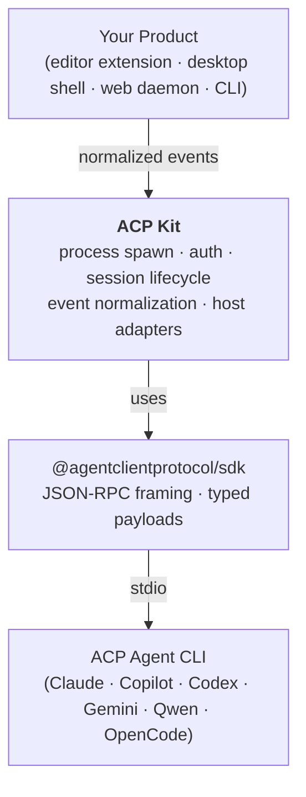

# ACP Kit

[](https://github.com/AcpKit/acp-kit/actions/workflows/ci.yml)
[](https://www.npmjs.com/package/@acp-kit/core)
[](https://www.npmjs.com/package/@acp-kit/core)
[](./LICENSE)
[](https://nodejs.org)
[](#status)

**ACP Kit is an Agent Client Protocol framework and runtime for building applications on top of [ACP](https://agentclientprotocol.com/).**

It launches an ACP agent process, manages the protocol connection, handles authentication, exposes host adapters for permissions / files / terminals, and turns raw `session/update` traffic into normalized turn, message, reasoning, and tool events. Use it when you need an agent client protocol framework for products such as editor extensions, desktop shells, web daemons, and CLIs. Your application chooses an agent profile, attaches a host, opens a session, and consumes stable events.

**Why ACP Kit:**

- **Stable events over messy `session/update`.** Per-message, per-tool, per-turn events with correlation ids (`messageId`, `toolCallId`, `turnId`) &mdash; drive UI state and transcripts without parsing raw protocol traffic.
- **Lifecycle is handled for you.** Cross-platform process spawn, startup diagnostics, `auth_required` retry, `session.error` surfacing, vendor `_meta` pass-through, multiple sessions over one agent process.
- **Enterprise runtime hooks.** Structured observations, startup diagnostics, runtime inspectors, session recordings, approval queues, and replay helpers let products audit and debug what an agent did.
- **Six common agents, one import.** `import { ClaudeCode, GitHubCopilot, CodexCli, GeminiCli, QwenCode, OpenCode } from '@acp-kit/core'` &mdash; or drive any other ACP-capable agent via a custom `AgentProfile`.

## Install

```bash
npm install @acp-kit/core
```

Requires Node.js **>= 20.11** and a reachable ACP agent CLI on `PATH`.

## Quick Start

```ts
import { createAcpRuntime, ClaudeCode } from '@acp-kit/core';

await using acp = createAcpRuntime({
  agent: ClaudeCode,
});

await using session = await acp.newSession({ cwd: process.cwd() });

session.on({
  messageDelta:  (e) => process.stdout.write(e.delta),
  toolStart:     (e) => process.stdout.write(`\n[tool ${e.toolCallId}] ${e.title ?? e.name}\n`),
  toolEnd:       (e) => process.stdout.write(`[tool ${e.toolCallId}] ${e.status}\n`),
  turnCompleted: (e) => process.stdout.write(`\n(turn ${e.turnId} done: ${e.stopReason})\n`),
});

await session.prompt('Summarize this repository.');
```

If your application wants a single turn object while preserving live streaming updates, use `collectTurnResult(...)`:

```ts
import { collectTurnResult } from '@acp-kit/core';

const result = await collectTurnResult(session, 'Summarize this repository.', {
  onUpdate: (snapshot) => render(snapshot.text, snapshot.tools),
});

console.log(result.text);
```

`createAcpRuntime(...)` defaults to approving tool permissions once and selecting the first offered auth method. See [Getting Started](docs/getting-started.md) for explicit host policy, the full event vocabulary, multi-session use, and how to debug startup / auth failures.

For a one-shot prompt, the helper API handles session disposal and yields the same event stream. Use `onRuntimeEvent(...)` only when you already have an event value, such as inside this `for await` loop; when you have a `RuntimeSession`, prefer `session.on(...)`.

```ts
import { runOneShotPrompt, onRuntimeEvent, ClaudeCode } from '@acp-kit/core';

for await (const event of runOneShotPrompt({
  agent: ClaudeCode,
  cwd: process.cwd(),
  prompt: 'Summarize this repository.',
})) {
  onRuntimeEvent(event, {
    messageDelta: (e) => process.stdout.write(e.delta),
  });
}
```

## Examples

The repository ships with five runnable examples under [`examples/`](examples/). Each one is a standalone npm package that installs the published `@acp-kit/core` from npm:

| Example | What it shows |
| --- | --- |
| [`quick-start/`](examples/quick-start/) | Minimal single-prompt script. |
| [`author-reviewer-loop`](../../packages/author-reviewer-loop/) | Runnable `npx` package: AUTHOR writes files, REVIEWER inspects them in a separate context, and the loop continues until `APPROVED`. |
| [`mock-runtime/`](examples/mock-runtime/) | Self-contained mock ACP server. Use this to see the full event flow without installing an agent. |
| [`real-agent-cli/`](examples/real-agent-cli/) | Interactive CLI driver for real agents (`copilot`, `claude`, `codex`, `gemini`, `qwen`, `opencode`) with prompts for auth and permission decisions. |
| [`web-daemon/`](examples/web-daemon/) | Tiny `node:http` + Server-Sent Events demo: POST a prompt, stream normalized events back to a browser. |

```bash
cd examples/mock-runtime
npm install
npm start
```

See [`examples/README.md`](examples/README.md) for details.

## What ACP Kit Does



Without ACP Kit, every product that wants to host an ACP agent has to write the same plumbing: pick the right CLI for the platform, spawn it without breaking on Windows shells or login envs, surface stderr when it fails to start, run `initialize`, retry `session/new` after `auth_required`, expose host capabilities only when the application actually backs them, parse `session/update` notifications into something a UI can render, and decide when a turn is really done.

ACP Kit packages all of that behind `createAcpRuntime({...}).newSession({ cwd })` (or the `runOneShotPrompt` one-shot helper). The agent stays a regular ACP server; your application stays a regular consumer of typed events. See [Architecture](docs/architecture.md) for the layer breakdown.

## API Overview

`RuntimeSession` emits **normalized `RuntimeSessionEvent`s**: stable per-message, per-tool, and per-turn events with correlation ids (`messageId`, `toolCallId`, `turnId`). They drive transcripts, UI state, and multi-agent orchestration. If you need raw protocol traffic (debuggers, protocol bridges), `composeWireMiddleware` / `normalizeWireMiddleware` let you observe the exact JSON-RPC frames.

Create the runtime with an agent profile. Add a host only for the capabilities and policy hooks your application backs:

```ts
import {
  createAcpRuntime,
  ClaudeCode,
  PermissionDecision,
  type RuntimeHost,
  type AgentProfile,
} from '@acp-kit/core';

await using acp = createAcpRuntime({
  agent: ClaudeCode,           // built-in constant, or a custom AgentProfile literal
  host: {
    requestPermission: async (req) => PermissionDecision.AllowOnce,
    chooseAuthMethod:  async ({ methods }) => methods[0]?.id ?? null,
    // readTextFile / writeTextFile / createTerminal+friends are advertised to
    // the agent only when you provide them. See docs/api-overview.md.
  } satisfies RuntimeHost,
});
```

Diagnostics and replay are first-class runtime features. Use an inspector while developing, and attach a recorder when you need a durable audit/debug artifact:

```ts
import {
  createAcpRuntime,
  createRuntimeInspector,
  isAcpStartupError,
  formatStartupDiagnostics,
  ClaudeCode,
} from '@acp-kit/core';
import { createFileSessionRecorder } from '@acp-kit/core/node';

const inspector = createRuntimeInspector({ includeWire: true });
const recording = createFileSessionRecorder({ dir: '.acp/recordings' });

try {
  await using acp = createAcpRuntime({ agent: ClaudeCode, inspector, recording });
  await acp.ready();
} catch (error) {
  if (isAcpStartupError(error)) {
    console.error(formatStartupDiagnostics(error.diagnostics));
  }
  throw error;
}
```

Then open a session, subscribe to events, send prompts:

```ts
await using session = await acp.newSession({ cwd: '/path/to/workspace' });

session.on({
  messageDelta:  (e) => process.stdout.write(e.delta),
  toolStart:     (e) => process.stdout.write(`[tool ${e.toolCallId}] ${e.title ?? e.name}\n`),
  toolEnd:       (e) => process.stdout.write(`[tool ${e.toolCallId}] ${e.status}\n`),
  turnCompleted: (e) => process.stdout.write(`done: ${e.stopReason}\n`),
});

const result = await session.prompt('Refactor utils.ts'); // Promise<PromptResult>
await session.cancel();        // optional: cancel the in-flight turn
// session and runtime are disposed automatically by `await using`
```

Lifecycle helpers: `acp.shutdown()` (explicit teardown), `acp.reconnect()` (drop the agent process and reconnect), `session.setMode(modeId)` / `session.setModel(modelId)` (switch mid-session when the agent advertises options). One-shot helper: `runOneShotPrompt({ agent, cwd, prompt })` yields `RuntimeSessionEvent`s and disposes everything when iteration completes.

The full surface is exported from a single entry point: `@acp-kit/core`. See [API Overview](docs/api-overview.md) for the complete `RuntimeHost`, `AcpRuntime`, `RuntimeSession`, and `RuntimeSessionEvent` reference.

## Supported ACP Agents

ACP Kit can drive any agent that speaks the Agent Client Protocol over stdio. Six agents ship as named constants you import and pass as `agent: <Constant>`:

| Agent | Constant |
| --- | --- |
| Claude Code | `ClaudeCode` |
| GitHub Copilot | `GitHubCopilot` |
| Codex CLI | `CodexCli` |
| Gemini CLI | `GeminiCli` |
| Qwen Code | `QwenCode` |
| OpenCode | `OpenCode` |

> The runtime treats every agent uniformly: features like `session/load`, `setMode`, `setModel`, `session/list`, file system, and terminal capabilities are forwarded to whichever agent advertises them in its `initialize` response. Inspect `acp.agentCapabilities` after the runtime is ready to see exactly what a given agent CLI version supports.

To override one field on a built-in profile (e.g. `agent: { ...ClaudeCode, env: { ANTHROPIC_API_KEY } }`) or to drive a brand-new agent via a custom [`AgentProfile`](packages/core/src/agents.ts) literal, see [Supported Agents](docs/agents.md) for per-agent details (command/args, login flow, known quirks).

## How It Compares to `@agentclientprotocol/sdk`

ACP Kit is built **on top of** [`@agentclientprotocol/sdk`](https://www.npmjs.com/package/@agentclientprotocol/sdk), not as a replacement.

- `@agentclientprotocol/sdk` is the **protocol toolkit**. It gives you `ClientSideConnection`, `ndJsonStream`, typed request/response/notification payloads, and JSON-RPC framing &mdash; once you already have a connection to an ACP server.
- ACP Kit is the **client runtime**. It launches the agent, manages the connection lifecycle, runs auth, exposes host adapters, normalizes raw protocol updates into stable events, and tracks turn state.

The protocol layer underneath stays exactly `@agentclientprotocol/sdk`. ACP Kit does not fork it, replace it, or hide it &mdash; it depends on it as a regular npm dependency. For the full layered diagram and side-by-side code comparison, see [SDK vs Runtime](docs/acp-sdk-vs-runtime.md).

## Compatibility

| Dependency | Version |
| --- | --- |
| `@agentclientprotocol/sdk` | `^0.18` |
| Node.js | `>= 20.11` (matches the package's `engines` field; CI tests Node 20 and 22) |
| TypeScript (consumers) | `>= 5.2` (for `using` / `await using` syntax) |
| OS | Windows, macOS, Linux |

ACP Kit aims to track the latest stable `@agentclientprotocol/sdk` minor release. Breaking changes in the SDK will be matched by a minor or major bump in `@acp-kit/core` while v0.x is in effect.

## Status

ACP Kit is **experimental (v0.x)**. The public API may change between minor versions until v1.0; every breaking change is called out in [`CHANGELOG.md`](CHANGELOG.md). See [`docs/migration-plan.md`](docs/migration-plan.md) for incremental adoption.

## Documentation

- [Getting Started](docs/getting-started.md) &mdash; install, first session, common failures
- [API Overview](docs/api-overview.md) &mdash; complete `RuntimeHost`, `AcpRuntime`, `RuntimeSession`, and event reference
- [Supported Agents](docs/agents.md) &mdash; per-agent command, login, known quirks
- [SDK vs Runtime](docs/acp-sdk-vs-runtime.md) &mdash; the boundary between the official SDK and ACP Kit
- [Architecture](docs/architecture.md) &mdash; runtime layers and design principles
- [Package Plan](docs/package-plan.md) &mdash; why ACP Kit ships as a single package today
- [Migration Plan](docs/migration-plan.md) &mdash; incremental adoption path for existing ACP products

## Development

```bash
npm install        # install workspace deps (packages/core only)
npm run build      # tsc -b packages/core
npm test           # vitest run
```

To try an example: `cd examples/mock-runtime && npm install && npm start`.

Contributions are welcome. Please open an issue to discuss non-trivial changes before sending a PR.

## License

[MIT](./LICENSE)
